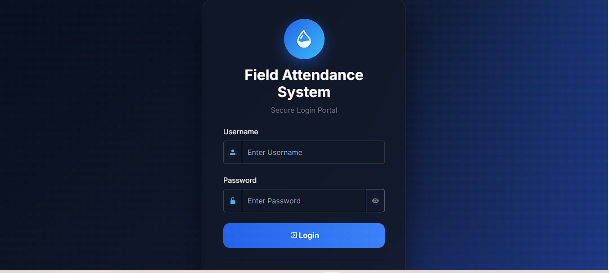
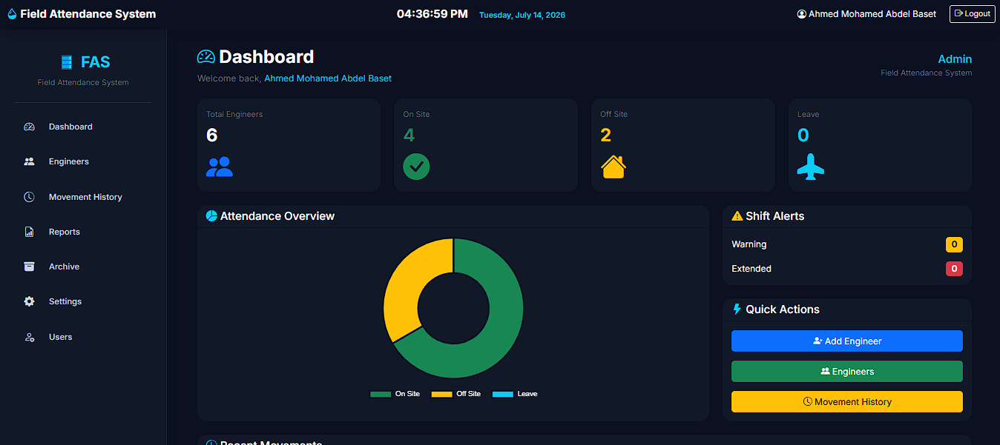
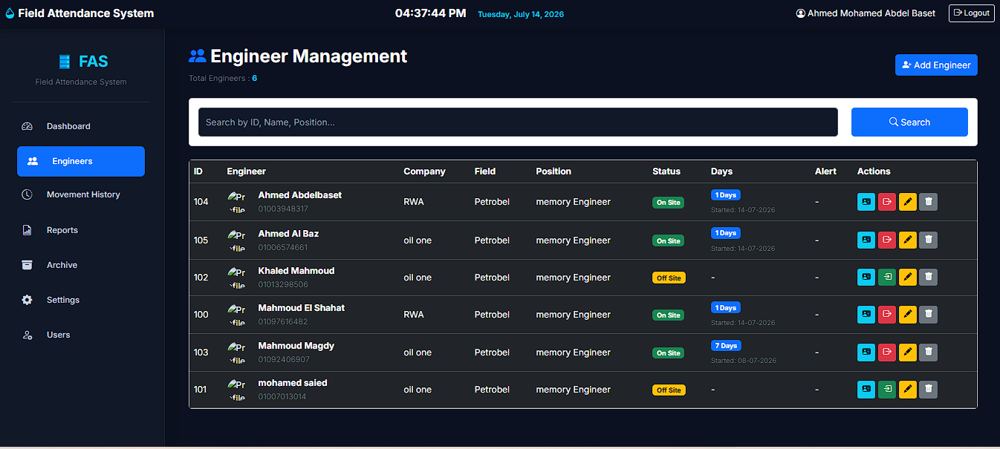
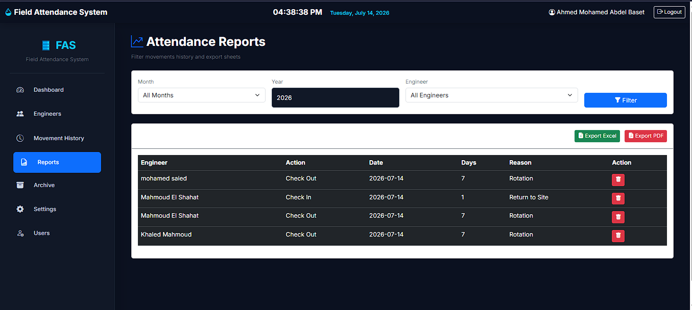

# Field Attendance Management System

A professional web-based attendance management system built with **Python** and **Flask** to manage engineers, attendance records, shift rotations, and reporting through a modern dashboard.

---

## Features

- Secure User Authentication
- Engineer Management
- Attendance Tracking
- Shift Rotation Management
- Interactive Dashboard
- Reports
- SQLite Database
- Responsive User Interface

---

## Built With

- Python
- Flask
- SQLAlchemy
- SQLite
- HTML5
- CSS3
- Bootstrap 5
- JavaScript

---

## Project Structure

```
FieldAttendance/
│
├── app/
├── instance/
├── templates/
├── static/
├── migrations/
├── config.py
├── run.py
└── requirements.txt
```

---

## Screenshots

### Login



### Dashboard



### Engineers



### Reports



---

## Installation

```bash
git clone https://github.com/ahmedabdelbaset2950-svg/FieldAttendance.git

cd FieldAttendance

pip install -r requirements.txt

python run.py
```

---

## Future Improvements

- Email Notifications
- Export Reports to Excel & PDF
- Advanced Dashboard Analytics
- Cloud Database Support

---

## Author

**Ahmed Mohamed Abdel Basset**

Geophysics Engineer | Python Developer

LinkedIn:
https://www.linkedin.com/in/ahmed-abdel-baset-4a3713288/

GitHub:
https://github.com/ahmedabdelbaset2950-svg
